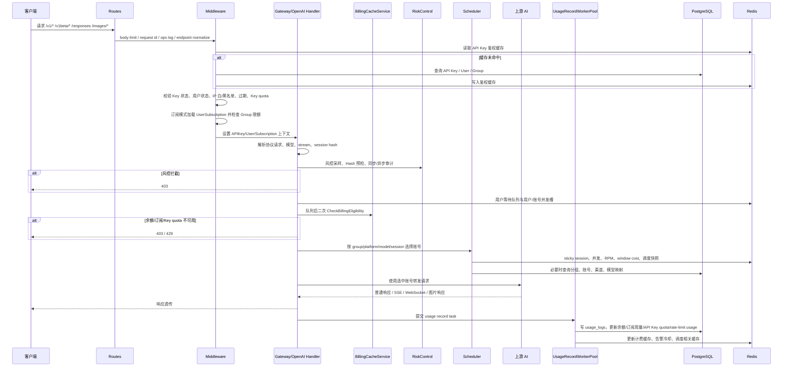
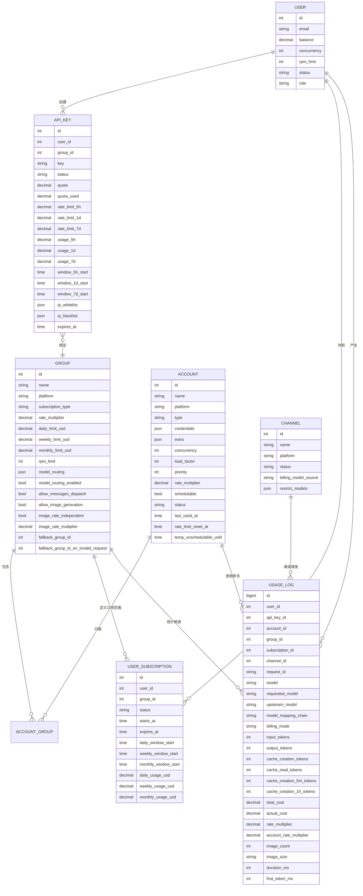
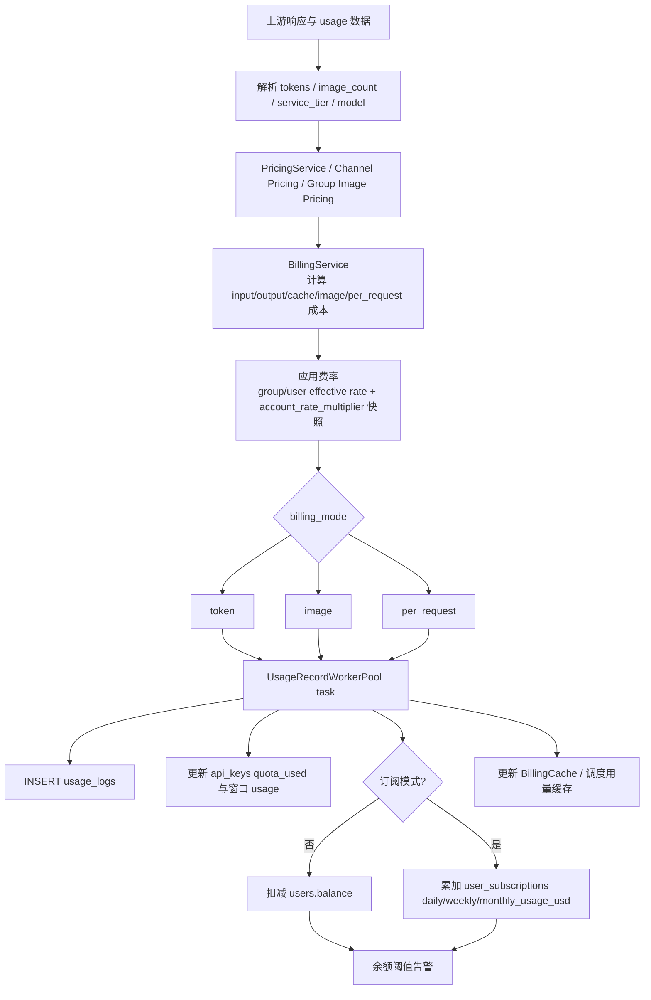
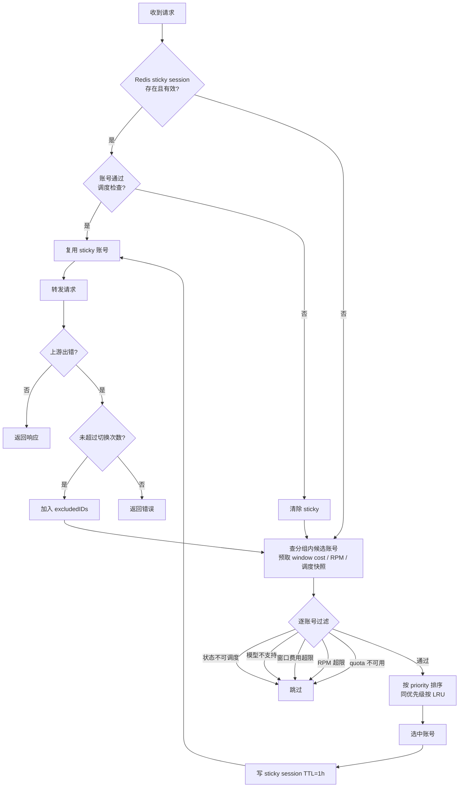
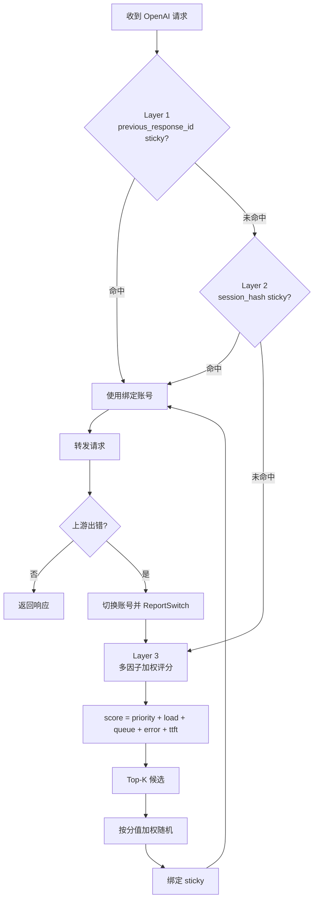
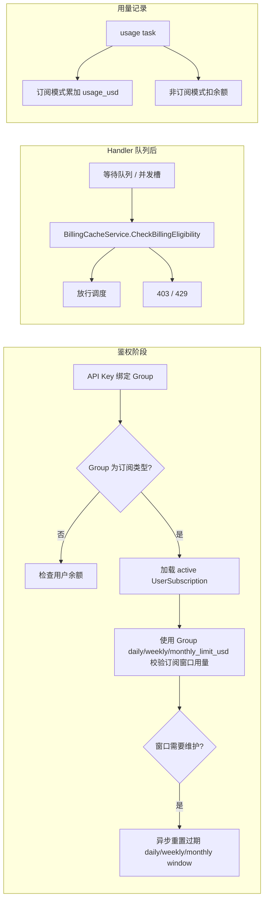
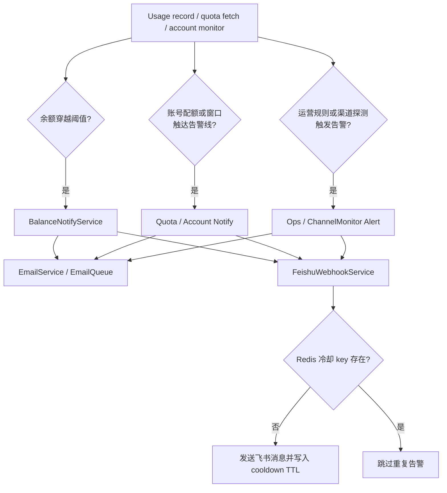
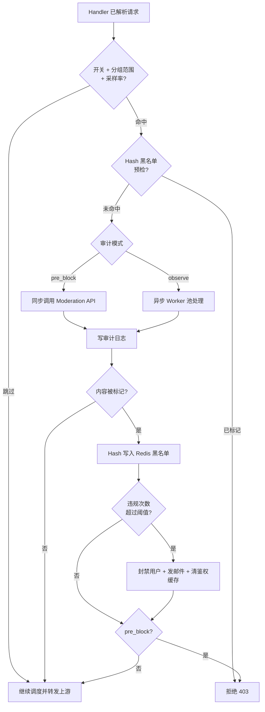

# sub2api 核心架构分析

本文档描述 sub2api 当前实现中的系统架构、核心模块边界和关键数据流程。定位是“核心架构参考”，不是完整 API 手册；具体管理接口和页面细节以代码与专题文档为准。

---

## 目录

- [系统定位](#系统定位)
- [整体架构](#整体架构)
- [请求代理完整流程](#请求代理完整流程)
- [账号与分组数据模型](#账号与分组数据模型)
- [计费链路](#计费链路)
- [账号调度策略](#账号调度策略)
- [订阅配额系统](#订阅配额系统)
- [通知告警系统](#通知告警系统)
- [风控中心](#风控中心)
- [功能全景总结](#功能全景总结)
- [扩展设计](#扩展设计)

---

## 系统定位

sub2api 是一个**订阅转 API 代理网关**。它将上游 AI 服务商（Anthropic、OpenAI、Gemini、Antigravity 等）的订阅账号额度汇集管理，通过统一的 API Key 体系对外分发，实现多租户鉴权、余额/订阅计费、配额隔离、账号调度、故障切换和运营告警。

**技术栈**

| 层次 | 技术 |
|------|------|
| 后端框架 | Go 1.25 + Gin（含 h2c HTTP/2 支持） |
| 数据库 | PostgreSQL 15+（Ent ORM） |
| 缓存 | Redis 7+（鉴权缓存、sticky session、并发/限流、计费缓存、告警冷却） |
| 前端 | Vue 3.4 + TypeScript（构建产物内嵌至二进制） |
| 入口 | `backend/cmd/server/main.go` |

---

## 整体架构

```mermaid
graph TB
    subgraph 客户端
        U[用户 / 开发者 / SDK]
    end

    subgraph 网关入口
        RT[Routes<br/>gateway.go]
        MW[Middleware<br/>body limit / request id / ops log / API Key auth]
        AH[GatewayHandler<br/>Anthropic / Gemini / Antigravity 兼容]
        OH[OpenAIGatewayHandler<br/>Chat / Responses / Images / WebSocket]
    end

    subgraph 业务核心
        GS[GatewayService<br/>Claude/Gemini/Antigravity 账号选择与协议转发]
        OGS[OpenAIGatewayService<br/>OpenAI 协议转发与用量记录]
        SCHED[Schedulers<br/>LRU / LoadAwareness / OpenAIAccountScheduler]
        BILL[BillingService + BillingCacheService<br/>计费计算与资格缓存]
        USAGE[UsageRecordWorkerPool<br/>异步用量记录与扣费]
        SUB[SubscriptionService<br/>订阅窗口与配额检查]
        MAP[Channel / Model Mapping<br/>渠道、模型映射、fallback group]
        RISK[ContentModerationService<br/>内容风控]
        OPS[OpsService / ChannelMonitor<br/>错误日志、指标、渠道探测]
        PAY[Payment / Redeem / Affiliate<br/>订单、兑换码、返佣]
    end

    subgraph 上游平台
        ANT[Anthropic / Claude]
        OAI[OpenAI / GPT]
        GEM[Google Gemini]
        AG[Antigravity]
    end

    subgraph 数据层
        PG[(PostgreSQL<br/>业务持久化)]
        RD[(Redis<br/>缓存 / 并发 / 限流 / 冷却)]
    end

    subgraph 通知
        EMAIL[邮件 / EmailQueue]
        FEISHU[飞书 Webhook]
    end

    U --> RT --> MW
    MW --> SUB
    MW --> AH
    MW --> OH
    AH --> RISK
    OH --> RISK
    AH --> GS
    OH --> OGS
    GS --> SCHED
    OGS --> SCHED
    SCHED --> MAP
    GS --> ANT & GEM & AG
    OGS --> OAI
    ANT & GEM & AG --> GS
    OAI --> OGS
    GS --> BILL
    OGS --> BILL
    BILL --> USAGE
    USAGE --> PG
    PAY --> PG
    OPS --> PG
    MAP --> PG
    MW -.-> RD
    SCHED -.-> RD
    BILL -.-> RD
    RISK -.-> RD
    USAGE --> EMAIL & FEISHU
```

**分层边界**

- `routes/gateway.go` 负责注册协议入口，并按 `group.platform` 将部分兼容端点分派到 Anthropic/Gemini/Antigravity 或 OpenAI handler。
- `handler` 层负责请求体读取、协议解析、风控接入、等待队列、并发槽、failover 循环、响应透传和 usage 记录任务提交。
- `service` 层负责账号选择、模型映射、上游协议适配、计费计算、订阅维护、通知、运营指标和支付等业务能力。
- Redis 是热路径支撑，不是业务事实来源；用户、账号、分组、订阅、订单、用量日志等最终以 PostgreSQL 为准。

---

## 请求代理完整流程

**重要行为**

- `/v1/messages`、`/v1/chat/completions`、`/v1/responses` 等兼容端点会根据 API Key 绑定分组的 `platform` 自动分派，不等同于固定平台。
- failover 由 handler 与 service 协作完成：handler 维护失败账号集合、重试次数、stream 是否已开始；service 负责排除失败账号并重新选号。
- 用量记录默认走 `UsageRecordWorkerPool` 异步执行；图片等必须计费的任务在队列拒绝时会同步兜底，避免漏扣。
- `/v1/usage` 只做鉴权，不执行余额/订阅扣费拦截，用于允许过期或额度耗尽的 Key 查询自身用量。

**支持的代理端点**

| 路径 | 方法 | 平台/行为 |
|------|------|-----------|
| `/v1/messages` | POST | 按 `group.platform` 自动分派：Anthropic/Antigravity 或 OpenAI Messages Dispatch |
| `/v1/messages/count_tokens` | POST | Anthropic/Antigravity token count；OpenAI 分组返回不支持 |
| `/v1/models` | GET | Anthropic 兼容模型列表 |
| `/v1/usage` | GET | 网关用量查询，跳过计费执行 |
| `/v1/chat/completions` | POST | 按 `group.platform` 自动分派到 OpenAI 或兼容转换路径 |
| `/chat/completions` | POST | 无 `/v1` 前缀别名，按 `group.platform` 自动分派 |
| `/v1/responses`、`/v1/responses/*subpath` | POST | OpenAI Responses 或兼容转换路径 |
| `/responses`、`/responses/*subpath` | POST | 无 `/v1` 前缀别名 |
| `/v1/responses`、`/responses` | GET | OpenAI Responses WebSocket |
| `/backend-api/codex/responses`、`/backend-api/codex/responses/*subpath` | POST | Codex 直连 Responses 兼容入口 |
| `/backend-api/codex/responses` | GET | Codex 直连 Responses WebSocket |
| `/v1/images/generations`、`/images/generations` | POST | OpenAI 图片生成 |
| `/v1/images/edits`、`/images/edits` | POST | OpenAI 图片编辑 |
| `/v1beta/models`、`/v1beta/models/:model`、`/v1beta/models/*modelAction` | GET/POST | Gemini 原生 API 兼容层 |
| `/antigravity/models` | GET | Antigravity 模型列表 |
| `/antigravity/v1/*` | GET/POST | Antigravity 专属 Anthropic 兼容路由 |
| `/antigravity/v1beta/*` | GET/POST | Antigravity 专属 Gemini 兼容路由 |

---

## 账号与分组数据模型

**核心关系说明**

- **用户 -> API Key**：一对多，每个 Key 可绑定一个分组；Key 级 quota 与 5h/1d/7d rate limit 独立记录。
- **分组 -> 账号**：多对多，通过 `account_groups` 连接表关联；账号可按平台、优先级、状态、模型支持、窗口费用和 RPM 参与调度。
- **分组 -> 订阅限额**：`Group` 定义 daily/weekly/monthly limit；`UserSubscription` 记录用户在该分组内的窗口起点和已用金额。
- **请求路径**：`API Key -> Group -> Handler -> Scheduler -> Account -> Upstream`；模型映射和 fallback group 可能改变最终候选账号或上游模型。
- **用量日志**：`UsageLog` 是追加型明细表，保存 requested/upstream model、渠道、订阅、token、费用、图片和延迟字段，供扣费、看板和运营分析使用。

**账号类型**

| platform | type | 说明 |
|----------|------|------|
| anthropic | oauth | Claude 订阅 OAuth 账号 |
| anthropic | setup-token | Claude 企业 Setup Token |
| anthropic | api_key / bedrock / vertex | Anthropic API Key、Bedrock、Vertex 等直连或兼容账号 |
| openai | oauth | OpenAI 订阅 OAuth 账号 |
| openai | apikey | OpenAI API Key 账号 |
| gemini | oauth / apikey | Google Gemini 账号 |
| antigravity | oauth | Antigravity 账号 |

---

## 计费链路

**费用字段说明**

| 字段 / 口径 | 类型 | 含义 |
|-------------|------|------|
| `input_cost` / `output_cost` / `cache_creation_cost` / `cache_read_cost` | `usage_logs` 字段 | 按模型定价拆分出的基础成本 |
| `total_cost` | `usage_logs` 字段 | 按标准定价计算的原始费用 |
| `actual_cost` | `usage_logs` 字段 | 用户/API Key 口径实际计费金额，通常受分组或用户有效倍率影响 |
| `rate_multiplier` | `usage_logs` 字段 | 用户计费倍率快照 |
| `account_rate_multiplier` | `usage_logs` 字段 | 账号侧倍率快照，用于账号/分组成本统计 |
| `billing_mode` | `usage_logs` 字段 | `token`、`per_request`、`image` 等计费模式 |
| `account_cost` | 派生统计口径 | 账号侧成本，不是 `usage_logs` 物理字段 |
| `user_cost` | 派生统计口径 | 用户侧展示/统计口径，通常来自 `actual_cost` 或聚合结果 |

**扣费与用量更新**

- 非订阅模式：扣减 `users.balance`，允许扣费链路记录真实消费并由余额告警提示用户充值。
- 订阅模式：不扣用户余额，累加 `user_subscriptions.daily_usage_usd/weekly_usage_usd/monthly_usage_usd`，限额由绑定 `Group` 定义。
- 所有模式：更新 `api_keys.quota_used` 与 5h/1d/7d 窗口 usage，用于 Key 级额度和速率限制。
- usage 记录通常异步执行；任务会使用脱离请求取消的上下文，降低客户端断开导致漏记账的风险。

---

## 账号调度策略

系统按平台使用不同调度路径。Claude/Gemini/Antigravity 主要通过 `GatewayService` 与兼容服务选择账号，OpenAI 通过 `OpenAIAccountScheduler` 与 `GatewayService.SelectAccountWithScheduler*` 相关路径协作。所有平台都受到分组、账号状态、模型支持、并发、sticky session 和 failover 约束。

---

### Claude 账号调度

**Claude 选号优先级规则**

1. **账号优先级**（`account.priority`）：数值越小越优先，低优先级账号不会抢占高优先级账号。
2. **LRU（最久未使用）**：同优先级内选 `last_used_at` 最早的账号；从未使用过的账号优先。
3. **异步 LastUsedAt**：`last_used_at` 由 `DeferredService` 批量异步刷写，非实时强一致。

**Claude 账号的额外调度检查**

| 检查项 | 说明 | 对应字段 / 逻辑 |
|-------|------|----------------|
| 可调度状态 | 账号未禁用、未错误、未临时不可调度 | `account.IsSchedulable()`、`schedulable`、`status`、`temp_unschedulable_until` |
| 模型支持 | 账号支持请求模型或映射后的模型 | `isModelSupportedByAccount()` |
| 模型调度 | 账号未对该模型进入限流/不可调度状态 | `isAccountSchedulableForModelSelection()` |
| 配额检查 | APIKey/Bedrock 等类型未超出账号侧配额约束 | `isAccountSchedulableForQuota()` |
| 窗口费用 | 5h 窗口费用未超阈值 | `isAccountSchedulableForWindowCost()` |
| RPM 限制 | 每分钟请求数未超限 | `isAccountSchedulableForRPM()` |

**窗口费用（window_cost）三级状态**

| 状态 | 条件 | 行为 |
|------|------|------|
| `WindowCostSchedulable` | 累计费用低于阈值 | 正常参与选号 |
| `WindowCostStickyOnly` | 费用处于 sticky reserve 区间 | 仅 sticky 会话可复用，新会话跳过 |
| `WindowCostNotSchedulable` | 费用达到或超过阈值 | 新会话和 sticky 会话均跳过 |

---

### OpenAI（GPT）账号调度

OpenAI 使用独立调度器维护运行时动态信号，并由 handler 在 Chat、Responses、Images、WebSocket 等入口调用 `SelectAccountWithScheduler*` 相关路径。

**OpenAI 评分因子**

| 因子 | 含义 | 数据来源 |
|------|------|----------|
| `priorityFactor` | 账号优先级，越小越优先 | `account.priority` |
| `loadFactor` | 当前并发相对最大并发的空闲度 | Redis 实时并发槽 |
| `queueFactor` | 等待队列空闲度 | Redis 实时队列 |
| `errorFactor` | 错误率 EWMA，错误越多分数越低 | 调度器运行时统计 |
| `ttftFactor` | 首 token 延迟 EWMA，越低越优先 | 调度器运行时统计 |

---

### Gemini 账号调度

Gemini v1beta 入口由 Google 风格鉴权错误与 `GeminiMessagesCompatService`/`GatewayService.SelectAccountWithLoadAwareness` 协作处理：

- 支持 `/v1beta/models`、`/v1beta/models/:model`、`/v1beta/models/*modelAction` 等 Gemini SDK/CLI 直连接口。
- 文本和图片模型会按账号类型、模型支持、分组 supported scopes、账号状态、sticky session 和排除列表过滤。
- OAuth 与 API Key 账号在模型支持、凭证刷新、上游协议和偏好上有差异；调度会避免把不支持目标模型的账号放入候选。
- Gemini 最大故障转移次数默认 3 次，失败账号会加入本次请求的 excludedIDs。

---

### 模型路由与渠道映射

模型和渠道不是简单的“请求模型原样上游转发”：

- `Group.model_routing` 可按模型模式指定优先账号列表，`model_routing_enabled` 控制是否启用。
- OpenAI Messages Dispatch 可在 OpenAI 分组中接收 `/v1/messages`，并按 `messages_dispatch_model_config` 或默认映射模型转到 GPT 模型。
- Channel 模型映射会记录 `requested_model`、`upstream_model`、`model_mapping_chain` 和 `channel_id`，用于审计、统计和计费。
- `fallback_group_id` 与 `fallback_group_id_on_invalid_request` 允许特定请求降级到其他分组，常见于 Claude Code 限制或无效请求兜底。

---

**调度参数**

| 参数 | 默认值 / 行为 |
|------|---------------|
| sticky session TTL | 1 小时 |
| Claude 最大故障转移次数 | 10 次 |
| Gemini 最大故障转移次数 | 3 次 |
| 并发控制字段 | `account.concurrency`（默认 3）与用户 `concurrency` |
| LastUsedAt 刷写方式 | `DeferredService` 批量异步写入 DB |
| 跨平台切换 | 不支持；分组 `platform` 决定请求协议与候选账号平台 |

**多账号负载分摊行为**

| 请求场景 | 分摊效果 | 原因 |
|---------|---------|------|
| 多用户 / 多会话并发请求 | 自动分摊 | session hash 不同，各自独立选号 |
| 同一会话多轮消息 | 默认不分摊 | sticky session 在 TTL 内复用同一账号 |
| 账号限流、窗口费用耗尽、上游故障 | 自动尝试切换 | handler 将失败账号加入 excludedIDs 并重新选号 |
| 单账号分组 | 无可切换目标 | 限流或故障时只能原地重试或返回错误 |

---

## 订阅配额系统

**配额维度**

| 维度 | 限额来源 | 用量来源 |
|------|----------|----------|
| Daily | `groups.daily_limit_usd` | `user_subscriptions.daily_usage_usd`，窗口起点 `daily_window_start` |
| Weekly | `groups.weekly_limit_usd` | `user_subscriptions.weekly_usage_usd`，窗口起点 `weekly_window_start` |
| Monthly | `groups.monthly_limit_usd` | `user_subscriptions.monthly_usage_usd`，窗口起点 `monthly_window_start` |

**关键规则**

- API Key 鉴权中间件负责加载订阅、检查 Key 状态/过期/quota、IP 限制、用户状态和订阅窗口限额。
- 请求进入 handler 后，先排队和获取并发槽，再二次执行 `CheckBillingEligibility`，避免长时间等待后余额或订阅已不可用。
- `/v1/usage` 是特殊查询接口：只鉴权，不做余额/订阅计费拦截。
- 订阅窗口维护异步执行，不阻塞主请求链路。

---

## 通知告警系统

**告警触发条件**

| 告警类型 | 触发条件 | 通知对象 |
|---------|---------|---------|
| 用户余额不足 | `oldBalance >= threshold && newBalance < threshold` | 用户本人 + 管理员 |
| 账号配额告警 | 账号日/周/总额度触达告警阈值 | 管理员 |
| 渠道/运营告警 | Channel Monitor、Ops 错误聚合或告警规则命中 | 管理员或配置的 webhook |

**服务边界**

- `BalanceNotifyService` 负责余额阈值判断和余额通知编排。
- `FeishuWebhookService` 负责飞书 webhook 配置、消息发送和 Redis 冷却。
- `EmailService`/`EmailQueueService` 负责邮件发送与异步队列。
- Redis 冷却只用于防止重复告警刷屏，不替代 PostgreSQL 中的业务事实和历史记录。

---

## 风控中心

`risk_control_enabled` 开关同时控制**管理后台入口**（关闭时路由重定向，开启时菜单可见）和**网关内容审计链路**。网关侧风控发生在 handler 解析请求之后、上游转发之前；因此它可以基于协议、模型、用户、API Key 和分组做采样与拦截。

### 审计链路

**审计模式**

| 模式 | 行为 |
|------|------|
| `pre_block` | 同步检测，违规拦截返回 403 |
| `observe` | 异步记录，不拦截请求 |
| `off` | 关闭审计 |

### 核心机制

**Worker 池**：固定大小的 goroutine 池（默认 4 个，最大 32），`observe` 模式下异步入队不阻塞请求链路；队列满时丢弃任务并计数。

**API Key 熔断**：多 Key 轮询，按 HTTP 状态码自动冻结（401/403 冻结 10 分钟，429 冻结 1 分钟，其他错误 10 秒）。

**数据脱敏**：输入内容送审前自动屏蔽 URL、Bearer Token、JWT、API Key、HEX 串、UUID 等敏感信息。

**Hash 预检**：违规内容的 SHA256 Hash 写入 Redis 黑名单，相同输入再次请求时直接拦截，无需调用 API。

**采样率**：基于 Hash 确定性采样（0-100%），相同输入采样决策始终一致。

**自动封禁**：`violation_window_hours` 内违规次数超过 `ban_threshold`（默认 10 次 / 30 天）则封禁用户并清除 Redis 鉴权缓存；计数在每次封禁后重置。

**日志清理**：后台 Worker 每 24 小时执行一次，命中日志默认保留 180 天，未命中日志保留 3 天。

### 核心文件

| 文件 | 职责 |
|------|------|
| `backend/internal/service/content_moderation.go` | 主服务：Worker 池、审计调度、封禁、日志 |
| `backend/internal/service/content_moderation_input.go` | 多协议输入提取（Anthropic / OpenAI / Gemini） |
| `backend/internal/service/content_moderation_redact.go` | 数据脱敏 |
| `backend/internal/repository/content_moderation_hash_cache.go` | Redis Hash 黑名单 |
| `backend/internal/handler/admin/content_moderation_handler.go` | HTTP 处理器（`/admin/risk-control/*`） |
| `backend/internal/handler/content_moderation_helper.go` | 网关集成点 |

### 混合渠道风险检查

与风控开关**相互独立**，始终生效。创建或编辑账号时，若将 **Antigravity** 和 **Anthropic** 账号放入同一分组，系统弹出警告（可确认后强制继续）。实现位于 `service/admin_service.go: checkMixedChannelRisk()`。

---

## 功能全景总结

| 模块 | 核心文件 / 目录 | 关键能力 |
|------|----------------|---------|
| **路由注册** | `backend/internal/server/routes/gateway.go` `backend/internal/server/routes/admin.go` | 网关路由、管理 API、用户 API、平台分派 |
| **鉴权** | `backend/internal/server/middleware/api_key_auth.go` `backend/internal/service/api_key_auth_cache*.go` | API Key、用户状态、IP 限制、Key quota、订阅预检查、Redis 缓存 |
| **请求代理** | `backend/internal/handler/gateway_handler.go` `backend/internal/handler/openai_gateway_handler.go` `backend/internal/service/gateway_service.go` | 多协议兼容、SSE/WebSocket、failover、响应透传 |
| **账号调度** | `backend/internal/service/gateway_service.go` `backend/internal/service/openai_account_scheduler*.go` | sticky session、LRU、LoadAwareness、多因子评分、故障切换 |
| **Gemini 兼容** | `backend/internal/handler/gemini_v1beta_handler.go` `backend/internal/service/gemini_messages_compat_service.go` | Gemini v1beta SDK/CLI 兼容、模型过滤、OAuth/API Key 调度 |
| **渠道与模型映射** | `backend/internal/service/channel_service.go` `backend/internal/repository/channel_repo*.go` | 渠道配置、模型映射、计费来源、requested/upstream model 记录 |
| **计费** | `backend/internal/service/billing_service.go` `backend/internal/service/billing_cache_service.go` `backend/internal/service/usage_record_worker_pool.go` | Token/图片/按请求计费、资格缓存、异步用量记录、余额/订阅/Key quota 更新 |
| **订阅配额** | `backend/internal/service/subscription_service.go` `backend/internal/repository/user_subscription_repo.go` | Group 限额、UserSubscription 窗口用量、异步窗口维护 |
| **用量分析** | `backend/internal/service/dashboard_service.go` `backend/internal/service/dashboard_aggregation_service.go` | 趋势图、模型分布、分组统计、聚合缓存 |
| **账号管理** | `backend/internal/handler/admin/account_handler.go` `backend/internal/service/account_service.go` | OAuth/API Key 多类型账号、代理、过期、调度状态、窗口监控 |
| **账号预热与定时测试** | `backend/internal/service/account_warmup_service.go` `backend/internal/repository/scheduled_test_repo.go` | 账号预热、定时探测、自动恢复 |
| **Channel Monitor** | `backend/internal/service/channel_monitor_*.go` `backend/internal/repository/channel_monitor_repo.go` | 渠道健康探测、模板、聚合、告警 |
| **Ops 错误与指标** | `backend/internal/service/ops_service*.go` `backend/internal/repository/ops_repo*.go` `backend/internal/handler/ops_error_logger.go` | 上游错误日志、系统指标、趋势、告警规则、请求详情 |
| **通知告警** | `backend/internal/service/balance_notify_service.go` `backend/internal/service/feishu_webhook_service.go` `backend/internal/service/email_queue_service.go` | 邮件 + 飞书双通道、冷却防刷、余额/账号/运营告警 |
| **风控中心** | `backend/internal/service/content_moderation*.go` `backend/internal/handler/admin/content_moderation_handler.go` | 内容审计、Worker 池、自动封禁、Hash 预检 |
| **支付/订单** | `backend/internal/payment/` `backend/internal/handler/payment*.go` `backend/ent/schema/payment_order.go` | 支付提供商、订单、webhook、金额/币种/手续费 |
| **兑换码/优惠码/返佣** | `backend/internal/handler/redeem_handler.go` `backend/internal/repository/redeem_code_repo.go` `backend/internal/service/affiliate_service.go` | 兑换码、优惠码、推广返佣、审计快照 |
| **OAuth/身份体系** | `backend/internal/handler/auth_*_oauth.go` `backend/internal/service/auth_*.go` `backend/ent/schema/auth_identity.go` | 邮箱、微信、Linux.do、OIDC、钉钉等登录与身份绑定 |
| **代理/TLS 指纹** | `backend/internal/repository/proxy_repo.go` `backend/internal/pkg/tlsfingerprint/` | 代理管理、延迟探测、TLS 指纹配置 |
| **数据管理/备份** | `backend/internal/service/data_management_service.go` `backend/internal/repository/backup_*.go` | 数据导入导出、备份、S3 存储 |
| **用量清理** | `backend/internal/handler/usage_handler.go` `backend/internal/repository/usage_cleanup*.go` | 用量清理任务、取消审计、历史维护 |
| **管理后台** | `frontend/src/views/admin/` `frontend/src/stores/` | 全局配置、仪表盘、账号/分组/用户/订单/风控管理 |

---

## 扩展设计

以下模块为独立设计文档，描述尚未实现或待规划的功能：

| 功能 | 文档 | 说明 |
|------|------|------|
| **对话内容记录** | [CONVERSATION_LOG_DESIGN.md](./CONVERSATION_LOG_DESIGN.md) | 可选地记录用户与 AI 的完整对话内容，用于调试、审核与合规留存 |
