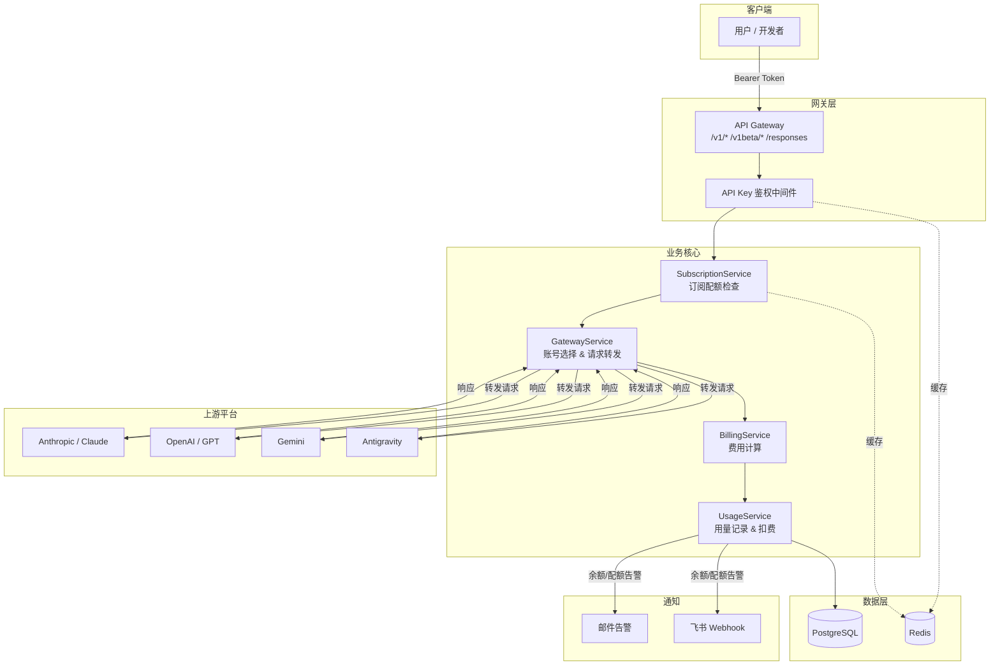
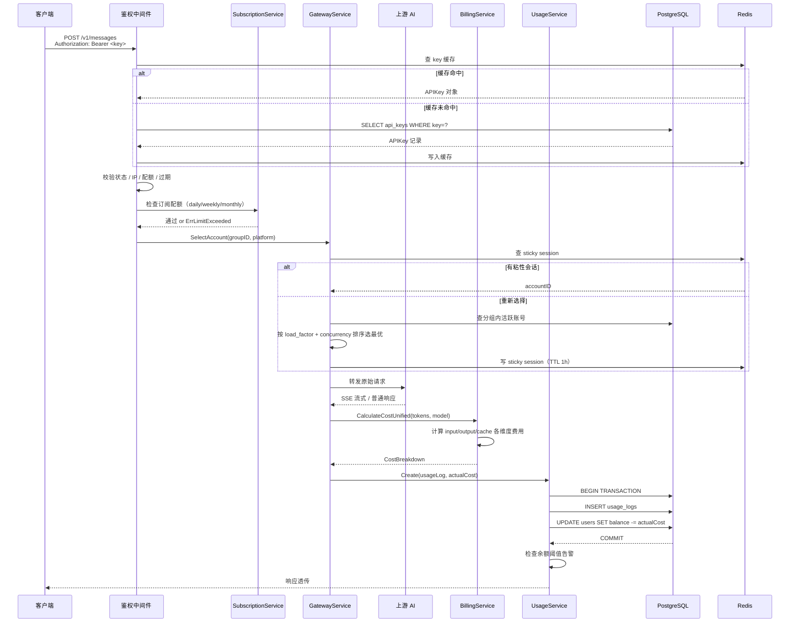
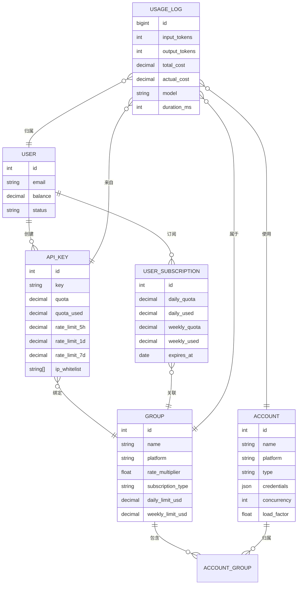
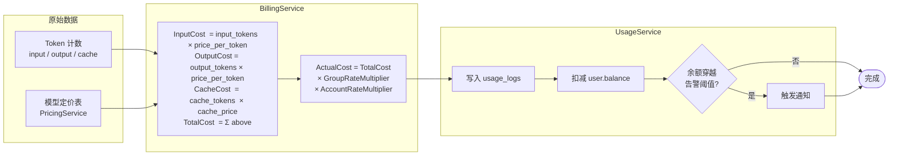
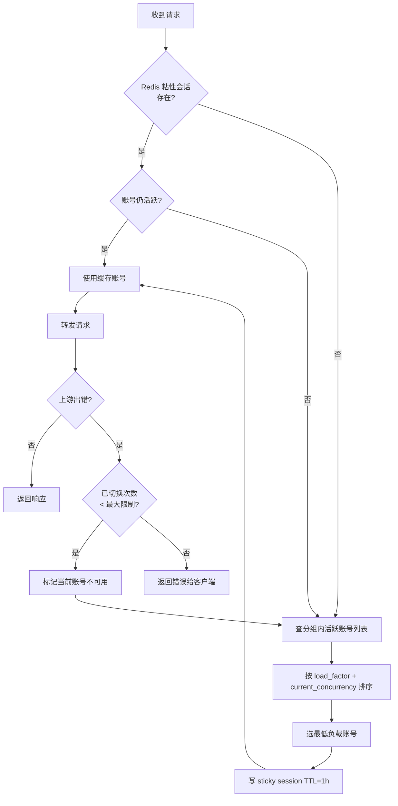
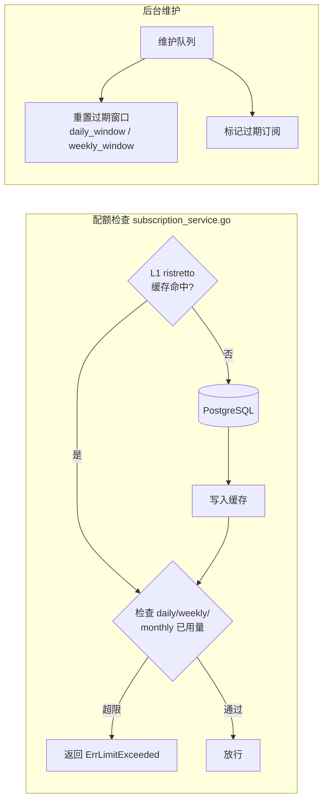
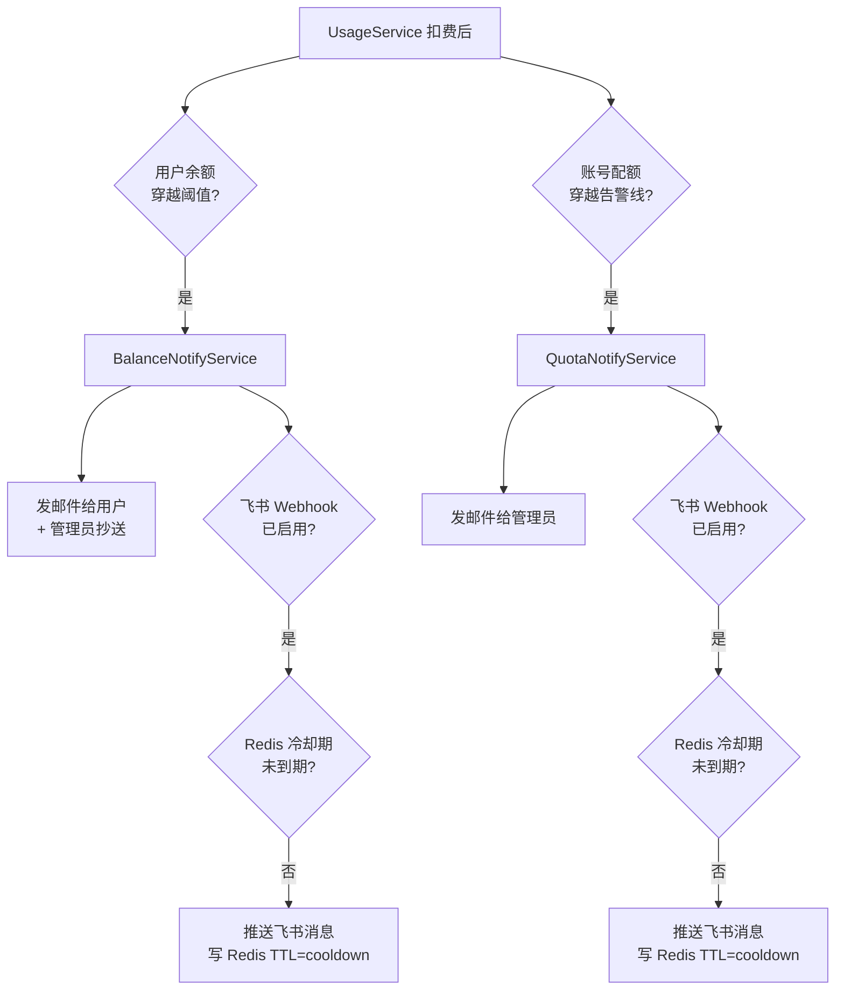

# sub2api 核心架构分析

本文档全面描述 sub2api 的系统架构、核心功能模块及关键数据流程。

---

## 目录

- [系统定位](#系统定位)
- [整体架构](#整体架构)
- [请求代理完整流程](#请求代理完整流程)
- [账号与分组数据模型](#账号与分组数据模型)
- [计费链路](#计费链路)
- [账号调度策略](#账号调度策略)
- [订阅配额系统](#订阅配额系统)
- [通知告警系统](#通知告警系统)
- [功能全景总结](#功能全景总结)

---

## 系统定位

sub2api 是一个**订阅转 API 代理网关**。它将上游 AI 服务商（Anthropic、OpenAI、Gemini 等）的订阅账号额度汇集管理，通过统一的 API Key 体系对外分发，实现多租户计费、配额隔离与智能调度。

**技术栈**

| 层次 | 技术 |
|------|------|
| 后端框架 | Go 1.25 + Gin（含 h2c HTTP/2 支持） |
| 数据库 | PostgreSQL 15+（Ent ORM） |
| 缓存 | Redis 7+（鉴权缓存、速率限制、计费缓存） |
| 前端 | Vue 3.4 + TypeScript（构建产物内嵌至二进制） |
| 入口 | `backend/cmd/server/main.go` |

---

## 整体架构

---

## 请求代理完整流程

**支持的代理端点**

| 路径 | 平台 |
|------|------|
| `POST /v1/messages` | Anthropic / Claude |
| `POST /v1/chat/completions` | OpenAI / GPT |
| `POST /v1beta/*` | Gemini |
| `POST /responses` | OpenAI Responses API |
| `POST /images/generations` | OpenAI 图像生成 |
| `POST /antigravity/v1/*` | Antigravity 专属路由 |

---

## 账号与分组数据模型

**核心关系说明**

- **用户 → API Key**：一对多，每个 Key 可绑定一个分组
- **分组 → 账号**：多对多（通过 `account_groups` 连接表），支持优先级排序
- **用户 → 订阅**：一个用户可在多个分组中持有订阅，各自独立配额
- **请求路径**：`API Key → Group → Account → 上游平台`

**账号类型**

| platform | type | 说明 |
|----------|------|------|
| anthropic | oauth | Claude 订阅 OAuth 账号 |
| anthropic | setup-token | Claude 企业 Setup Token |
| openai | oauth | OpenAI 订阅 OAuth 账号 |
| gemini | oauth / apikey | Google Gemini 账号 |
| antigravity | oauth | Antigravity 账号 |

---

## 计费链路

**费用字段说明**

| 字段 | 含义 |
|------|------|
| `total_cost` | 按标准定价计算的原始费用 |
| `actual_cost` | 经 GroupRateMultiplier × AccountRateMultiplier 后的实际扣费 |
| `account_cost` | 账号侧成本（用于分组统计） |
| `user_cost` | 用户侧计费（含用户级乘数，供用户看板展示） |

---

## 账号调度策略

**调度参数**

| 参数 | 值 |
|------|-----|
| 粘性会话 TTL | 1 小时 |
| Claude 最大故障转移次数 | 10 次 |
| Gemini 最大故障转移次数 | 3 次 |
| 并发控制字段 | `account.concurrency`（默认 3） |

---

## 订阅配额系统

**配额维度**

| 维度 | 说明 |
|------|------|
| `daily_quota` / `daily_used` | 当日滚动窗口 |
| `weekly_quota` / `weekly_used` | 当周滚动窗口 |
| `monthly_quota` / `monthly_used` | 当月滚动窗口 |

超出任意维度均会拒绝本次请求，返回对应错误（`ErrDailyLimitExceeded` 等）。

---

## 通知告警系统

**告警触发条件**

| 告警类型 | 触发条件 | 通知对象 |
|---------|---------|---------|
| 用户余额不足 | `oldBalance >= threshold && newBalance < threshold` | 用户本人 + 管理员 |
| 账号配额超限 | 日/周/总额度触达告警阈值 | 管理员 |

- 冷却以「告警类型 + 实体 ID」为 key，用户余额和账号各自独立计算
- 冷却状态存储于 Redis，服务重启不重置
- 默认冷却时间 30 分钟，可在管理后台「飞书 Webhook」Tab 调整（1–1440 分钟）

---

## 功能全景总结

| 模块 | 核心文件 | 关键能力 |
|------|---------|---------|
| **请求代理** | `handler/gateway_handler.go` `service/gateway_service.go` | 多平台统一接口、SSE 流式透传 |
| **账号调度** | `service/gateway_service.go:200+` | 粘性会话、负载均衡、自动故障转移 |
| **鉴权** | `middleware/api_key_auth.go` | IP 白/黑名单、配额、过期、Redis 缓存 |
| **订阅配额** | `service/subscription_service.go` | 日/周/月滚动窗口、L1 ristretto 缓存 |
| **计费** | `service/billing_service.go` `service/usage_service.go` | 多维度 Token 计费、多重乘数、原子扣减 |
| **用量分析** | `service/dashboard_service.go` | 趋势图、模型分布、分组统计 |
| **账号管理** | `handler/admin/account_handler.go` | OAuth/ApiKey 多类型、用量窗口监控 |
| **通知告警** | `service/balance_notify_service.go` `service/feishu_webhook_service.go` | 邮件 + 飞书双通道、冷却防刷 |
| **管理后台** | `frontend/src/views/admin/` | 全局配置、实时仪表盘、分组账号用量卡片 |
| **路由注册** | `server/routes/gateway.go` `server/routes/admin.go` | 网关路由、管理 API、用户 API |
