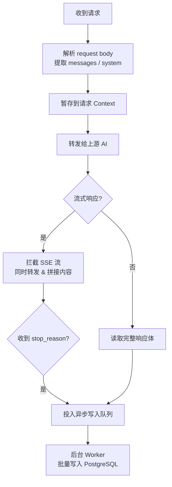

# 对话内容记录功能设计

本文档描述在 sub2api 中实现对话内容记录（Conversation Logging）功能的完整设计方案。

> **当前状态**：设计草案，尚未实现。

---

## 目录

- [背景与目标](#背景与目标)
- [核心挑战](#核心挑战)
- [数据模型](#数据模型)
- [拦截点设计](#拦截点设计)
- [后端实现要点](#后端实现要点)
- [配置项设计](#配置项设计)
- [查询界面设计](#查询界面设计)
- [注意事项](#注意事项)
- [实施建议](#实施建议)

---

## 背景与目标

sub2api 作为完整的中间人代理，请求和响应都经过其进程内存：

```
用户消息 → [sub2api 进程] → 上游 AI
上游 AI  → [sub2api 进程] → 用户客户端
```

当前系统的 `usage_logs` 表**只记录 Token 计量和费用**，不持久化任何对话内容。

本功能旨在提供可选的对话内容记录能力，适用于以下场景：

| 场景 | 说明 |
|------|------|
| 调试排查 | 复现用户反馈的异常请求 |
| 内容审核 | 检查是否存在违规使用 |
| 合规留存 | 企业内部合规要求 |
| 用量分析 | 了解用户真实使用模式 |

---

## 核心挑战

| 挑战 | 原因 | 解决思路 |
|------|------|---------|
| **流式响应** | SSE 分片返回，不能等全部收完再处理，否则阻塞响应 | 同步转发 + 异步拼接 |
| **内容体积大** | 长上下文可能达几十 KB，同步写库会增加延迟 | 异步队列批量写入 |
| **并发量高** | 每个请求都写一次，直接落库压力大 | Channel + Worker 池 |

---

## 数据模型

新增独立表 `conversation_logs`，通过 `usage_log_id` 与现有计费记录关联，互不干扰。

```sql
CREATE TABLE conversation_logs (
    id                BIGSERIAL PRIMARY KEY,
    usage_log_id      BIGINT REFERENCES usage_logs(id),  -- 关联计费记录
    user_id           BIGINT NOT NULL,
    api_key_id        BIGINT NOT NULL,
    group_id          BIGINT,
    account_id        BIGINT,
    model             VARCHAR(128),

    -- 请求内容
    request_messages  JSONB,        -- 原始 messages 数组
    system_prompt     TEXT,         -- system 字段单独存（便于检索）
    request_at        TIMESTAMPTZ NOT NULL,

    -- 响应内容
    response_content  TEXT,         -- AI 完整回复（流式重组后）
    response_at       TIMESTAMPTZ,
    is_complete       BOOLEAN DEFAULT FALSE,  -- 流式是否完整接收

    -- 元数据
    stop_reason       VARCHAR(64),
    created_at        TIMESTAMPTZ DEFAULT NOW()
);

-- 常用查询索引
CREATE INDEX ON conversation_logs (user_id, created_at DESC);
CREATE INDEX ON conversation_logs (api_key_id, created_at DESC);
CREATE INDEX ON conversation_logs (usage_log_id);
```

**与 `usage_logs` 的分工**

| 表 | 职责 |
|----|------|
| `usage_logs` | Token 计量、费用、性能指标（不变） |
| `conversation_logs` | 对话内容、请求/响应文本（新增） |

---

## 拦截点设计



**核心原则：异步写入，绝不阻塞响应链路。**

---

## 后端实现要点

### 1. 请求内容提取

在 `gateway_handler.go` 转发前，将解析好的请求内容存入 Gin Context：

```go
// 定义 Context 传递的结构
type ConvLogCtx struct {
    Messages []Message
    System   string
    Model    string
    ReqAt    time.Time
}

// 在 handler 里解析完请求体后存入 ctx
c.Set("conv_log_ctx", &ConvLogCtx{
    Messages: req.Messages,
    System:   req.System,
    Model:    req.Model,
    ReqAt:    time.Now(),
})
```

### 2. 流式响应拦截

用 `io.Writer` 包装器同时做两件事——转发给客户端、收集内容：

```go
type teeWriter struct {
    upstream http.ResponseWriter // 转给客户端
    buf      strings.Builder     // 同时收集 SSE chunk
}

func (t *teeWriter) Write(p []byte) (int, error) {
    t.buf.Write(p)              // 收集内容
    return t.upstream.Write(p) // 透传给客户端
}
```

SSE 每个 chunk 格式为 `data: {...}\n\n`，需解析后拼接 `delta.text` / `delta.content` 字段得到完整回复。

### 3. 异步写入队列

```go
// 全局 channel，容量根据 QPS 评估
var convLogCh = make(chan ConversationLog, 10_000)

// 服务启动时开启后台 Worker（建议 2–4 个）
func startConvLogWorker(repo ConvLogRepository) {
    batch := make([]ConversationLog, 0, 100)
    ticker := time.NewTicker(2 * time.Second)
    for {
        select {
        case log := <-convLogCh:
            batch = append(batch, log)
            if len(batch) >= 100 { // 满 100 条立即批量写
                repo.BatchInsert(batch)
                batch = batch[:0]
            }
        case <-ticker.C: // 每 2 秒兜底写一次
            if len(batch) > 0 {
                repo.BatchInsert(batch)
                batch = batch[:0]
            }
        }
    }
}
```

满 100 条或每 2 秒批量写一次，大幅降低数据库写压力。

### 4. 队列满时的降级策略

```go
// 非阻塞投入队列，队列满则丢弃（不影响主链路）
select {
case convLogCh <- log:
default:
    // 队列满，记录 metrics 告警，丢弃本条日志
    metrics.ConvLogDropped.Inc()
}
```

---

## 配置项设计

在 `settings` 表中增加以下配置键，管理员可在后台动态调整：

| Key | 类型 | 说明 | 默认值 |
|-----|------|------|--------|
| `conv_log_enabled` | bool | 全局开关 | `false` |
| `conv_log_include_request` | bool | 是否记录请求内容 | `true` |
| `conv_log_include_response` | bool | 是否记录响应内容 | `true` |
| `conv_log_retention_days` | int | 保留天数（0 = 永久） | `30` |
| `conv_log_max_content_tokens` | int | 超过此 Token 数截断存储 | `8192` |

**分组级开关**：在 `groups` 表增加 `conv_log_enabled` 字段，支持对特定分组单独关闭（如敏感业务分组）。

---

## 查询界面设计

管理后台新增「对话记录」页面，支持多条件检索：

```
筛选条件：用户 / API Key / 分组 / 模型 / 时间范围 / 关键词

列表展示：
┌──────────────────────────────────────────────────────┐
│ 2026-05-15 10:23:41  alice@example.com               │
│ 模型: claude-opus-4-5   Token: 1,234 in / 856 out    │
├──────────────────────────────────────────────────────┤
│ [用户] 帮我写一段 Python 代码，实现快速排序算法...   │
│ [AI]   好的，以下是快速排序的 Python 实现：          │
│        ```python                                      │
│        def quicksort(arr): ...                        │
│        ```                                           │
└──────────────────────────────────────────────────────┘
```

**访问权限**：
- 管理员：可查看全部用户的对话记录
- 普通用户：仅可查看自己的对话记录（需单独开放入口）

---

## 注意事项

### 合规与隐私

> ⚠️ 实施前必须处理以下事项，否则可能涉及法律风险。

1. **用户知情同意** — 在服务条款中明确告知会记录对话内容
2. **数据隔离** — 不同用户的对话记录严格隔离，管理员访问行为应有操作日志
3. **加密存储** — 建议对 `request_messages` / `response_content` 字段做列级加密（AES-256）
4. **数据主权** — 自托管部署时数据在用户自己服务器上，公共部署需明确数据归属

### 性能

- 异步队列容量（默认 10,000）需根据峰值 QPS 评估，队列满时降级丢弃而非阻塞
- 超长 Context（如 200K Token）存全量会非常大，`conv_log_max_content_tokens` 做截断保护
- 冷数据（超过保留期）建议归档到对象存储（MinIO / S3），DB 只保留热数据索引

### 存储估算

| 假设 | 数值 |
|------|------|
| 日请求量 | 10 万次 |
| 平均内容大小 | 2 KB/条 |
| 日增存储 | ~200 MB |
| 30 天存储 | ~6 GB |

---

## 实施建议

建议分两个阶段实施：

**阶段一（基础版，约 3–5 天）**
- [ ] 数据库迁移：新增 `conversation_logs` 表
- [ ] 后端：请求内容提取 + 异步 Channel + Worker 批量写入
- [ ] 流式响应拼接
- [ ] 管理后台：基础列表查询页面
- [ ] 全局开关配置项

**阶段二（增强版）**
- [ ] 分组级独立开关
- [ ] 内容截断与存储上限
- [ ] 列级加密存储
- [ ] 冷数据归档到对象存储
- [ ] 关键词全文检索（PostgreSQL `tsvector`）
- [ ] 定时清理过期数据的后台任务
